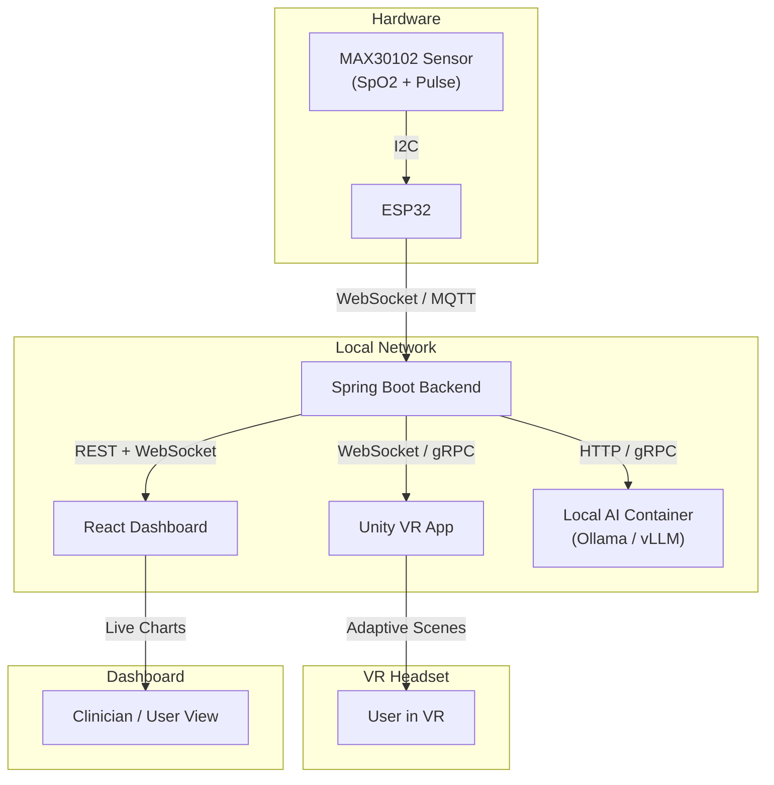

# 🧘 Serenity VR — Feasibility Analysis

## Project Summary

A VR-based anxiety management system with real-time biometric monitoring (SpO2 + pulse), a local AI model for adaptive therapy, a React dashboard for clinician/user monitoring, and a Spring Boot backend orchestrating everything.

---

## Proposed Architecture

---

## ✅ Is It Doable? — YES

This is a solid, impressive project. Each individual piece is well-documented and has community support. The challenge is **integration**, not individual components.

---

## 🔴 Physical / Hardware Limiting Factors

| Factor | Details | Severity |
|--------|---------|----------|
| **VR Headset Cost** | Meta Quest 3 (~$500) is the most accessible option. Tethered headsets (Valve Index, HTC Vive) need a powerful GPU. Quest 3 can run standalone OR tethered via Link cable. | 🟡 Medium |
| **Sensor Accuracy** | MAX30102 (SpO2 + pulse) is a hobbyist-grade sensor — **not medical grade**. Fine for a demo/prototype, but readings can be noisy with movement. | 🟡 Medium |
| **Sensor Placement** | User is wearing a VR headset — where does the finger sensor go? Finger clip works but adds a wire. Wrist-based sensors exist but are less accurate. | 🟡 Medium |
| **ESP32 Connectivity** | WiFi on ESP32 can have latency spikes (50-200ms). For real-time biofeedback in VR, you want <100ms end-to-end. BLE is more stable but adds complexity. | 🟡 Medium |
| **Gaming Laptop GPU** | Running a local LLM + Unity VR rendering on the **same GPU** will cause resource contention. A 3060 will struggle. A 3080+ or 4070+ is recommended. | 🔴 High |
| **Network Latency** | All on local network is good. But WiFi jitter can affect real-time feeds. Ethernet for the laptop is strongly recommended. | 🟢 Low |
| **Heat / Thermals** | Gaming laptop running AI inference + VR rendering = thermal throttling risk during extended sessions. | 🟡 Medium |

---

## 🟣 Software / Technical Limiting Factors

| Factor | Details | Severity |
|--------|---------|----------|
| **Local AI Model Size** | On a gaming laptop (8-16GB VRAM), you're limited to 7B-13B parameter models (Llama 3, Mistral, Phi-3). Good enough for conversational therapy guidance, but not GPT-4 level. | 🟡 Medium |
| **AI Response Latency** | Local 7B model on a 3060: ~2-5s per response. On a 4070+: ~0.5-2s. This is fine for guided exercises, NOT for real-time conversation. | 🟡 Medium |
| **Unity + Networking** | Unity's built-in networking is designed for multiplayer, not IoT data streams. You'll need a custom WebSocket client in Unity (NativeWebSocket or WebSocketSharp). | 🟡 Medium |
| **VR Development Learning Curve** | If you haven't built VR apps before, Unity XR Interaction Toolkit has a steep learning curve. Budget 2-4 weeks just for VR basics. | 🟡 Medium |
| **Spring Boot ↔ Unity Protocol** | No native integration. You'll build a WebSocket bridge. This is straightforward but needs careful error handling for disconnects. | 🟢 Low |
| **Real-Time Dashboard** | React + WebSocket for live charts is well-supported (libraries like Recharts, Chart.js, or D3). Not a blocker. | 🟢 Low |
| **ESP32 Firmware** | Arduino/PlatformIO for ESP32 is well-documented. MAX30102 libraries exist. Sending data over WiFi (MQTT or HTTP) is standard. | 🟢 Low |
| **Data Privacy / HIPAA** | If this is a real healthcare product, you need encryption, audit logs, consent management. For a prototype/demo, this is not a blocker but worth mentioning. | 🟢 Low (for demo) |
| **Concurrent GPU Workloads** | Running Ollama (AI) + Unity (VR rendering) simultaneously on one GPU requires careful VRAM management. Unity typically uses 2-4GB, leaving limited room for AI. | 🔴 High |

---

## 🛠️ Do You Need an ESP32?

**Yes, ESP32 is the right choice.** Here's why:

| Option | Verdict |
|--------|---------|
| **ESP32** ✅ | WiFi + BLE built-in, low power, great library support for MAX30102, cheap (~$5-10), perfect for this use case |
| **Arduino Uno/Nano** ❌ | No WiFi/BLE. Would need a separate WiFi shield. More hassle. |
| **Raspberry Pi Pico W** 🟡 | Viable alternative, but ESP32 has more community support for biomedical sensors |
| **Raspberry Pi (full)** ❌ | Overkill for just reading a sensor. ESP32 is leaner. |

---

## 🏗️ Recommended Tech Stack

| Layer | Technology | Notes |
|-------|-----------|-------|
| **Sensor** | MAX30102 + ESP32 | I2C connection, send data via MQTT or WebSocket |
| **Backend** | Spring Boot 3 + WebSocket (STOMP) | Central hub for all data routing |
| **Message Broker** | Mosquitto (MQTT) or Redis Pub/Sub | For real-time sensor data pub/sub |
| **Frontend** | React + Vite + Recharts | Live dashboard with WebSocket subscription |
| **VR Engine** | Unity 2022 LTS + XR Interaction Toolkit | Quest 3 or PC VR target |
| **AI Runtime** | Ollama or vLLM in Docker | Run Llama 3 8B or Mistral 7B locally |
| **AI Model** | Llama 3.1 8B (or Phi-3 Mini 3.8B) | Fine-tune or prompt-engineer for anxiety management |
| **VR ↔ Backend** | NativeWebSocket (Unity) → Spring WebSocket | Bidirectional real-time data |

---

## ⚡ The Biggest Risk: GPU Resource Contention

This is your #1 technical challenge. Running AI inference and VR rendering on the **same GPU**:

### Mitigation Strategies
1. **Use CPU-only AI inference** — Slower (~10-15s per response) but frees the GPU entirely for VR
2. **Use a tiny model** — Phi-3 Mini (3.8B) uses ~3GB VRAM, leaving room for Unity
3. **Separate machines** — Run AI on a different device on the network (even a second laptop)
4. **Async AI responses** — Don't need real-time AI. Generate guidance between VR scenes, not during rendering
5. **Use the Quest 3 standalone** — Offload VR rendering to the headset itself, freeing the laptop GPU entirely for AI

> [!IMPORTANT]
> **Best approach**: Use **Quest 3 standalone** for VR (no GPU needed on laptop) + **Ollama on laptop GPU** for AI. This completely eliminates the GPU contention problem.

---

## 📊 Effort Estimate (Solo Developer)

| Phase | Duration |
|-------|----------|
| Hardware setup (ESP32 + sensor) | 1-2 weeks |
| Spring Boot backend + WebSocket | 2-3 weeks |
| React dashboard with live data | 2-3 weeks |
| Local AI container setup + prompting | 1-2 weeks |
| Unity VR environment + basic scenes | 3-5 weeks |
| Integration (all components) | 2-4 weeks |
| Testing + polish | 2-3 weeks |
| **Total** | **~13-22 weeks** |

---

## 🎯 MVP Recommendation

Don't try to build everything at once. Here's a phased approach:

### Phase 1 — Sensor → Backend → Dashboard (Weeks 1-5)
- ESP32 reading SpO2 + pulse → MQTT → Spring Boot → WebSocket → React dashboard
- Get the **live data pipeline working end-to-end** first

### Phase 2 — VR Environment (Weeks 6-10)
- Basic calming VR scene in Unity (guided breathing, nature environment)
- Connect Unity to Spring Boot via WebSocket
- Biometric data drives VR scene changes (e.g., high heart rate → slower breathing cue)

### Phase 3 — AI Integration (Weeks 11-15)
- Ollama container running locally
- AI generates personalized guidance based on biometric trends
- AI responses fed into VR as voice/text prompts

### Phase 4 — Polish (Weeks 16-18)
- Session history, analytics, data export
- UI/UX polish on dashboard
- VR scene variety and transitions

---

## 💡 Final Verdict

| Aspect | Rating |
|--------|--------|
| **Feasibility** | ✅ Doable |
| **Impressiveness** | 🔥 Very high — combines IoT, AI, VR, and full-stack |
| **Complexity** | 🟡 High — the integration is the hard part, not the individual pieces |
| **Portfolio Value** | 💎 Exceptional — this is a standout project |
| **Solo Feasibility** | 🟡 Tight but possible in 4-5 months with focus |

> [!TIP]
> The key insight: **each component is individually straightforward**. The challenge is making them all talk to each other reliably in real-time. Start with the data pipeline (Phase 1), and everything else layers on top.
